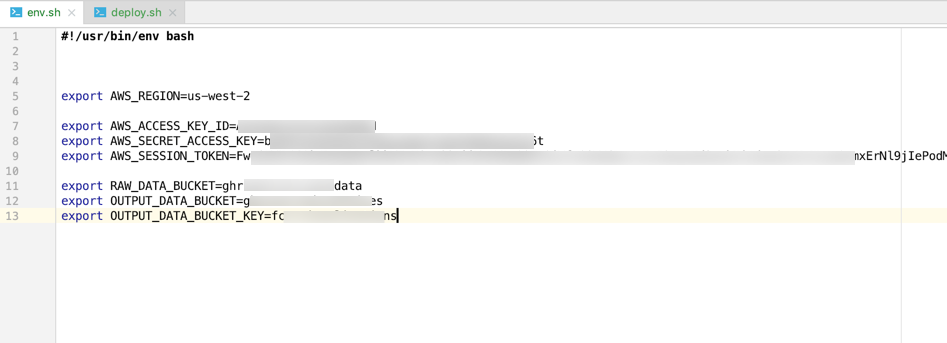

#Field Campaign Explorer Backend 

This repository contains scripts to deploy FCX backend infrastructure to AWS Cloud.

Currently, this is work-in-progress and scripts are hardcoded to process files for GOES-R PLT Field Campaign. In future, these scripts will be refactored to make them modular and follow proper coding convention.

Following dataset processing scripts are available. More information about these datasets can be found at [https://ghrc.nsstc.nasa.gov/uso/ds_details/collections/goesrpltC.html](https://ghrc.nsstc.nasa.gov/uso/ds_details/collections/goesrpltC.html)

* ABI
* CRS
* FEGS
* GLM
* ISS LIS
* LIP
* LMA

## Deployment

* Create a new EC2 instance or use an existing EC2 instance
* Create a file called env.sh and export following values
    * AWS_REGION
    * AWS_ACCESS_KEY_ID
    * AWS_SECRET_ACCESS_KEY
    * AWS_SESSION_TOKEN
    * RAW_DATA_BUCKET
    * OUTPUT_DATA_BUCKET
    * OUTPUT_DATA_BUCKET_KEY
    
    
* Run deploy.sh
* Processed data will be uploaded into specified S3 bucket. Enter this information in FCX Frontend configuration file.